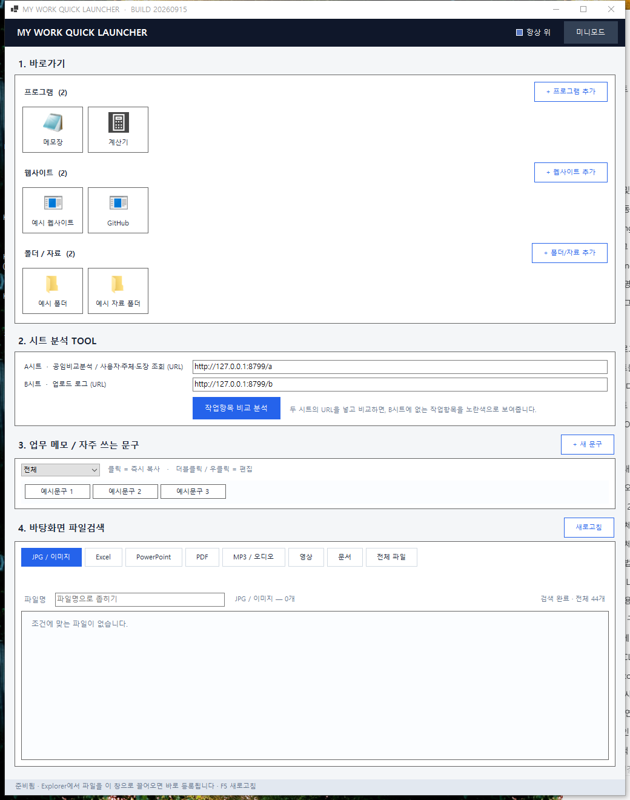
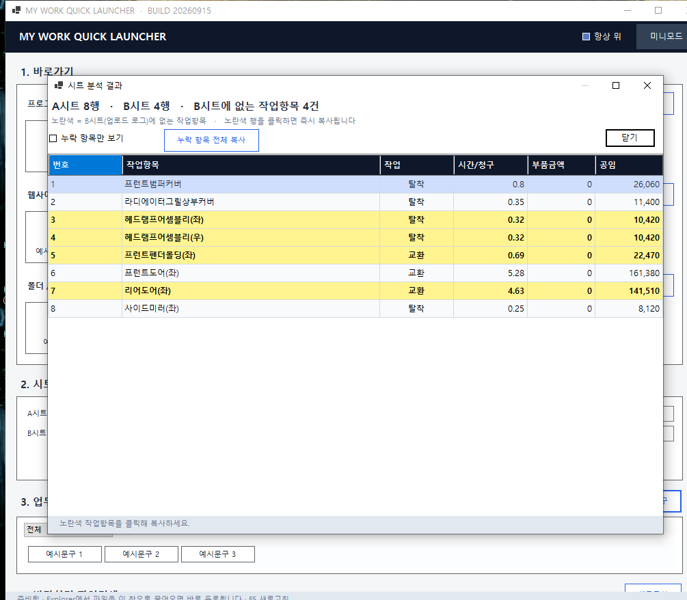

# MY WORK QUICK LAUNCHER

자동차 공업사·보험 견적 업무에서 반복되는 다섯 가지 일 — **바로가기 실행, 사내 견적 시트 비교, 업무 문구 복사, 바탕화면 파일 찾기, 다운로드 폴더 자동 감시** — 를 창 하나에 모은 Windows 데스크톱 도구입니다.



.NET 10 / Windows Forms로 작성됐고, 외부 라이브러리 없이 순수 BCL만 사용합니다. 설치 파일을 받아 실행하면 바로 쓸 수 있고, 데이터는 내 PC의 `%APPDATA%` 밖으로 나가지 않습니다(시트 비교 기능만 내가 직접 입력한 사내 서버 URL에 접속).

> 스크린샷은 전부 예시용 가짜 데이터로 새로 찍었습니다. 실제 업무 데이터는 포함돼 있지 않습니다.

---

## 목차

- [주요 기능](#주요-기능)
- [화면](#화면)
- [전체 워크플로우](#전체-워크플로우)
- [설치 방법](#설치-방법)
- [사용 방법](#사용-방법)
- [필요한 환경](#필요한-환경)
- [폴더 구조](#폴더-구조)
- [환경설정 / 데이터 위치](#환경설정--데이터-위치)
- [주의사항](#주의사항)
- [오류 해결](#오류-해결)
- [버전 / 업데이트 기록](#버전--업데이트-기록)
- [개발 정보](#개발-정보)

---

## 주요 기능

### 1. 바로가기
프로그램 · 웹사이트 · 폴더/자료를 카드로 등록해두고 클릭 한 번으로 실행합니다. Explorer에서 파일을 창으로 끌어다 놓으면 종류(exe/lnk/URL/폴더)를 자동으로 판별해 등록하고, 같은 영역 안에서 드래그로 순서를 바꿀 수 있습니다. 아이콘은 최초 등록 시점의 것을 저장해두기 때문에 이름을 바꿔도 바뀌지 않습니다.

### 2. 시트 분석 TOOL
사내 견적 시스템의 **A시트**(공임비교분석/사용자·주체·도장 조회) URL과 **B시트**(업로드 로그) URL을 하나씩 입력하면, 두 페이지 표의 **작업항목 열**을 비교합니다. A시트의 전체 견적을 팝업으로 보여주면서 **B시트에 없는 작업항목 행만 노란색으로** 표시하고, 그 행을 클릭하면 곧바로 클립보드에 복사됩니다.

### 3. 업무 메모 / 자주 쓰는 문구
견적·작업지시 등에서 반복해서 쓰는 문구를 그룹별로 등록해두고, 클릭 한 번으로 즉시 복사합니다. 더블클릭이나 우클릭으로 수정·삭제·순서 변경을 합니다.

### 4. 바탕화면 파일검색
바탕화면에 바로 보이는 파일(하위 폴더 제외)을 이미지/Excel/PowerPoint/PDF/오디오/영상/문서 등 확장자별로 즉시 필터링합니다. 이미지 파일은 썸네일로 미리 보여주고, 클릭 한 번으로 Explorer에서 위치를 선택하거나 더블클릭으로 바로 엽니다.

### 5. 파일자동읽기 폴더지정
감시할 폴더(기본 힌트: 다운로드 폴더)와, 그림이 든 zip이 도착했을 때 실행할 프로그램(등록된 바로가기 중에서 선택)을 지정해두면, 그 폴더에 이미지가 포함된 zip 파일이 새로 생길 때마다 **자동으로 해당 프로그램을 zip 경로와 함께 실행**합니다. 뒤이어 압축 프로그램(예: 알집)이 "압축풀기" 같은 확인 창을 띄우면, 제목에 지정한 문자열이 포함된 창을 잠깐 지켜보다가 **자동으로 닫아줍니다**.

---

## 화면

| 메인 화면 (1~4번 섹션) | 시트 분석 결과 (노란색 = 누락 작업항목) |
| :---: | :---: |
|  |  |

---

## 전체 워크플로우

이 프로그램은 하나의 순차적인 파이프라인이 아니라, 아래 다섯 가지를 **각자 독립적으로** 바로 실행합니다.

```
[바로가기 등록]         → 클릭 → 실행 (프로그램/웹사이트/폴더)
[A시트/B시트 URL 입력]  → 비교 분석 → 결과 팝업(노란색 = 누락) → 클릭 → 클립보드 복사
[업무 문구 등록]        → 클릭 → 클립보드 복사 → 다른 프로그램에 붙여넣기
[바탕화면 파일 검색]    → 필터 선택 → 결과 확인 → 클릭(선택) / 더블클릭(실행)
[감시 폴더 + 프로그램 지정] → zip 도착 감지 → 이미지 포함 확인 → 프로그램 자동 실행 → 압축 확인 창 자동 닫기
```

---

## 설치 방법

### 방법 A — 설치 파일 사용 (초보 사용자용, 권장)

1. [Releases](../../releases) 페이지에서 최신 버전의 zip을 내려받습니다.
2. 압축을 풉니다.
3. 둘 중 하나를 선택합니다.
   - **무설치**: `MyWorkQuickLauncher.exe`를 원하는 곳에 두고 더블클릭 → 바로 실행 (.NET 런타임 설치 불필요)
   - **설치**(바탕화면·시작 메뉴 바로가기, 프로그램 목록 등록): `INSTALL.cmd` 더블클릭 (관리자 권한 불필요). 제거는 `UNINSTALL.cmd` 또는 Windows "앱" 설정에서.

### 방법 B — Source Code 실행 (개발자용)

```bash
git clone https://github.com/<GITHUB_ACCOUNT>/my-work-quick-launcher.git
cd my-work-quick-launcher
dotnet build -c Release
dotnet run -c Release
```

배포용 단일 exe를 직접 만들려면:

```bash
publish.cmd
```
→ `publish\MyWorkQuickLauncher.exe` (약 47 MB, 자체 포함 · 런타임 설치 불필요)

더 자세한 재현 절차(전체 소스 포함)는 [REPRODUCTION_GUIDE.md](REPRODUCTION_GUIDE.md)를 참고하세요.

---

## 사용 방법

**Step 1. 프로그램 실행**
설치했거나 받은 `MyWorkQuickLauncher.exe`를 실행합니다. 처음 실행하면 빈 화면으로 시작합니다.

**Step 2. 자주 쓰는 항목 등록**
`1. 바로가기`에서 `+ 프로그램/웹사이트/폴더·자료 추가`를 누르거나 파일을 창으로 끌어다 놓습니다. `3. 업무 메모`에서 `+ 새 문구`로 자주 쓰는 문구를 등록합니다.

**Step 3. 시트 분석 (선택)**
`2. 시트 분석 TOOL`에 사내 견적 시스템의 A시트/B시트 URL을 입력하고 `작업항목 비교 분석`을 누릅니다.

**Step 4. 결과 확인**
팝업에서 노란색으로 표시된(B시트에 없는) 작업항목을 확인합니다. 행을 클릭하면 바로 복사됩니다.

**Step 5. 다른 프로그램에 붙여넣기**
복사된 문구나 작업항목을 `Ctrl+V`로 견적서, 메신저 등 어디든 붙여넣습니다.

---

## 필요한 환경

| 항목 | 내용 |
| --- | --- |
| OS | Windows 10 (1809+) / Windows 11, x64 |
| .NET | 설치 파일(`publish` 산출물) 사용 시 **불필요** (자체 포함). 소스로 빌드할 때만 **.NET SDK 10** 필요 |
| 필요 프로그램 | 없음 |
| 필요 라이브러리 | **없음** — 외부 NuGet 패키지 0개, .NET BCL + Windows Forms만 사용 |
| 관리자 권한 | 불필요 (설치/실행 모두) |

---

## 폴더 구조

```
my-work-quick-launcher/
├── *.cs                     소스 코드 (Program, MainForm, Model, Native, Theme, Dialogs, SheetAnalysis...)
├── MyWorkQuickLauncher.csproj
├── assets/app.ico            앱 아이콘
├── screenshots/               README용 예시 화면 캡처
├── installer/                 설치/배포 스크립트 (INSTALL.cmd, install.ps1, *.iss, pack.ps1)
├── publish.cmd                배포용 단일 exe 빌드 스크립트
├── README.md                  (이 문서)
├── REPRODUCTION_GUIDE.md       전체 소스 포함 재현 가이드
├── CHANGELOG.md
└── LICENSE
```

---

## 환경설정 / 데이터 위치

별도의 설정 파일이나 API 키가 필요 없습니다. 등록한 바로가기·문구·창 설정은 최초 실행 시 자동으로 아래 위치에 저장됩니다.

```
%APPDATA%\MyWorkQuickLauncher\data.json      바로가기·문구·창 설정
%APPDATA%\MyWorkQuickLauncher\launcher.log   실행/클릭/검색 이벤트 로그
```

시트 분석 TOOL의 A시트/B시트 URL은 **직접 입력**합니다(사내 시스템 주소이므로 프로그램에 내장돼 있지 않습니다). 마지막으로 입력한 URL만 `data.json`에 저장되어 다음 실행 시 복원됩니다.

---

## 주의사항

- 시트 분석 TOOL은 **사내망/VPN에서 접근 가능한 사내 견적 시스템 URL**이 있어야 동작합니다. 이 저장소에는 특정 회사의 서버 주소가 포함돼 있지 않습니다.
- 바탕화면 파일검색은 **바탕화면 최상위**(및 OneDrive 바탕화면)만 검색하며, 하위 폴더는 검색하지 않습니다.
- 데이터는 로컬(`%APPDATA%`)에만 저장됩니다. 프로그램을 삭제해도 데이터는 남으며, 완전히 지우려면 위 폴더를 직접 삭제하세요.
- 파일자동읽기 폴더지정은 **프로그램이 실행 중인 동안에만** 감시합니다(백그라운드 서비스로 상주하지 않습니다). 껐다 켜면 감시가 새로 시작되며, 실행 중 이미 처리한 zip은 같은 세션에서 다시 처리하지 않습니다.
- "자동으로 닫을 창 제목"은 화면에 떠 있는 **모든 창**을 대상으로 제목만 비교합니다. 다른 프로그램의 창 제목이 우연히 같은 문자열을 포함하면 그 창도 닫힐 수 있으니, 되도록 구체적인 문자열을 입력하세요.

---

## 오류 해결

| 증상 | 원인 / 해결 |
| --- | --- |
| 창이 항상 다른 프로그램 위에 떠서 가림 | "항상 위" 체크박스는 켤 때만 적용되고 저장되지 않습니다. 재실행하면 항상 꺼진 상태로 시작합니다. |
| 문구를 더블클릭해도 편집 창이 안 뜸 | 문구 타일은 좌클릭(복사)과 더블클릭(편집)을 구분합니다. 더블클릭이 빠르게 두 번 눌리는지 확인하세요. |
| 시트 분석에서 "시트를 불러오지 못했습니다" | 사내망/VPN 연결 및 URL을 확인하세요. |
| 바탕화면 파일이 예상보다 적게 나옴 | 하위 폴더는 검색 대상이 아닙니다(의도된 동작). |
| zip을 넣어도 프로그램이 실행 안 됨 | "자동 감시 사용"이 켜져 있는지, zip 안에 이미지 파일이 있는지, 실행할 프로그램이 선택돼 있는지 확인하세요(먼저 "1. 바로가기"에 프로그램을 등록해야 목록에 나타납니다). |
| 압축 확인 창이 안 닫힘 | "자동으로 닫을 압축 창 제목"이 실제 창 제목과 일치하는 문자열인지 확인하세요. zip 도착 후 약 10초간만 감시합니다. |

더 자세한 트러블슈팅은 [REPRODUCTION_GUIDE.md의 "알려진 이슈 및 트러블슈팅"](REPRODUCTION_GUIDE.md#9-알려진-이슈-및-트러블슈팅) 항목을 참고하세요.

---

## 버전 / 업데이트 기록

현재 버전: **v1.1.0**

전체 변경 이력은 [CHANGELOG.md](CHANGELOG.md)에 있습니다.

---

## 개발 정보

- 유지 관리: [GitHub 프로필](https://github.com/cjhtop9234ppp-tech)
- 버그 제보·기능 제안: [Issues](../../issues)
- 라이선스: [MIT](LICENSE)
